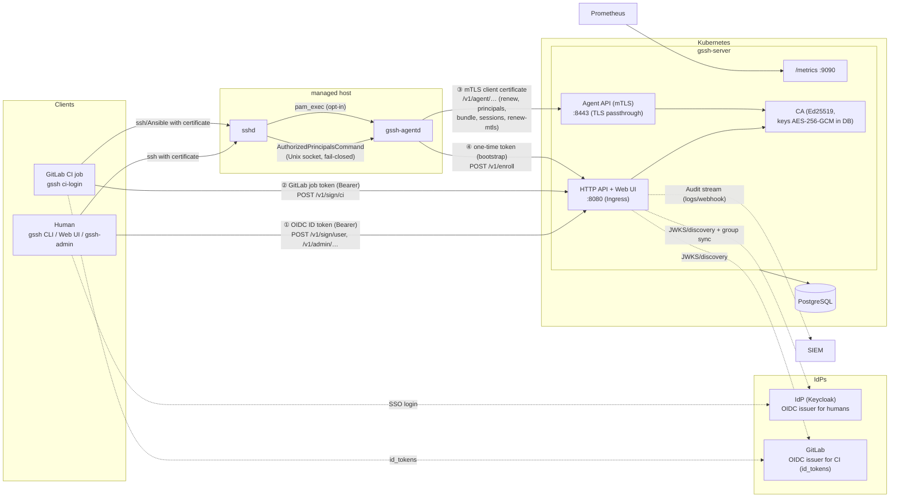

# Architecture

Overview of components, data flows, and auth paths. The corresponding
decisions are documented as ADRs — index: [adr/README.md](adr/README.md).
Operations view: [operations-manual.md](operations-manual.md).

## Components

| Component | Description |
|---|---|
| `gssh-server` | A single Go binary: REST API + CA, embedded web UI (Angular, `go:embed`, ADR-003), agent API (mTLS, dedicated port), metrics endpoint (dedicated port). Stateless — scales horizontally |
| PostgreSQL | sole persistence layer: users/groups, hosts/tags, grants, certificate metadata, encrypted CA keys (in `self-managed` mode these come from mounted files instead), append-only audit log (ADR-002) |
| `gssh` (CLI) | user CLI: SSO login, certificate held only in the ssh-agent (ADR-016); `gssh ci-login` for GitLab jobs |
| `gssh-admin` (CLI) | grant/CI-grant management via the admin API, declarative `apply` (GitOps) |
| Web UI | read-mostly views + grant CRUD/audit, roles derived from IdP groups (ADR-020); uses the same admin API |
| IdP (e.g. Keycloak) | OIDC issuer for humans (CLI: code + PKCE / device flow; UI: server-side code flow with client secret — BFF, session cookie, no token in the browser); optional group sync via the Keycloak admin API (ADR-015) |
| GitLab | second, strictly separate OIDC issuer for CI job tokens (`id_tokens`, ADR-019) |
| Host: `gssh-agentd` + sshd | host agent (enrollment, certificate/bundle maintenance, principals cache) and sshd with `TrustedUserCAKeys` + `AuthorizedPrincipalsCommand` (ADR-017); optional session/sudo audit via pam_exec (ADR-021) |
| SIEM | optional consumer of audit events (JSON logs on stdout and/or webhook) |

## Component and auth-path diagram

Three separate auth paths to the API (ADR-008) plus the one-time
enrollment token as bootstrap:



## Data flows

### SSO login (human)

```mermaid
sequenceDiagram
    participant U as User (gssh)
    participant IDP as IdP
    participant API as gssh-server
    participant AG as ssh-agent
    participant H as Host (sshd + agentd)

    U->>IDP: OIDC Authorization Code + PKCE (browser)<br/>or device flow
    IDP-->>U: ID token
    U->>U: ephemeral Ed25519 key pair
    U->>API: POST /v1/sign/user (Bearer ID token, public key)
    API->>API: verify token (iss/aud/exp/JWKS),<br/>map user (active?), check grants
    API-->>U: certificate (≤ 16 h, KeyID user:&lt;sub&gt;@&lt;idp&gt;,<br/>principals: username + email) + audit event
    U->>AG: load key + certificate (LifetimeSecs, never on disk)
    U->>H: ssh deploy@host
    H->>H: AuthorizedPrincipalsCommand → agentd<br/>(cache/API, fail-closed): does a grant match<br/>(group × tag selector × target user)?
    H-->>U: session (optional pam_exec → session audit)
```

### CI flow (GitLab)

Job token (`id_tokens`, `aud: guided-ssh`) → `gssh ci-login` →
`POST /v1/sign/ci`: verification against the GitLab JWKS, matching of
CI grants (project × ref/`protected_only` × environment × tags), lifetime =
min(grant, policy 1 h, token `exp`), KeyID
`ci:<project>:<pipeline>:<job>`, principals `ci:<project_path>` +
namespace ancestors. Details: [gitlab-ci.md](gitlab-ci.md).

### Enrollment and host operation

One-time token (`gssh-server enroll-token`, only the hash stored in the DB) →
`POST /v1/enroll` with host public key + mTLS CSR → response: host certificate,
`TrustedUserCAKeys` bundle, mTLS client certificate (CN = host UUID) + mTLS CA.
After that the daemon keeps everything current: host certificate and mTLS
certificate at 2/3 of their lifetime, CA bundle hourly. Details:
[enrollment-guide.md](enrollment-guide.md).

### Principals lookup (ACL evaluation on the host)

sshd asks the `AuthorizedPrincipalsCommand` helper on every login; the
daemon answers from its cache (< 10 s old) or via `GET /v1/agent/principals`
(mTLS, 5 s timeout). The server returns the identity principals of all
active members of groups whose grant lists the local user as a target
principal and whose tag selector matches the host's tags —
plus `ci:<project>` principals from matching CI grants. On API outage
the cache holds up to `cache_ttl` (default 5 m), then fails closed
(ADR-017/018/022).

### Session audit (opt-in)

pam_exec hooks (sshd, sudo) → `gssh-agentd pam-session` (fail-open) →
daemon's Unix socket (token-protected) → local spool →
`POST /v1/agent/sessions` (mTLS, every 15 s). Correlation: sshd passes the
serial (`%s`)/KeyID (`%i`) to the principals helper, and the server resolves
the serial to the user via `certificates` (ADR-021).

### Group sync

Periodic sync (default 5 m) via the Keycloak admin API
(`GSSH_KC_*`): user/group inventory and active status. Removing a user from
a group affects re-issuance (no grants ⇒ 403) **and** the host ACLs
(principals lookup) — offboarding with no manual steps.
The groups also come fresh from the token claims on every issuance.

## Separation of auth paths

| Path | Who | Mechanism | Endpoints |
|---|---|---|---|
| ① User OIDC | Humans — CLI/gssh-admin as bearer, web UI via session cookie | Bearer: IdP ID token, audience = `GSSH_CLIENT_OIDC_CLIENT_ID` (the CLIs' public client). Web UI: server-side login with the server's own confidential client (`GSSH_SERVER_OIDC_CLIENT_ID`), HttpOnly session cookie; roles/grants behind both | `/v1/sign/user`, `/v1/admin/…`, `/v1/auth/…` |
| ② GitLab OIDC | CI jobs | Job token (`id_tokens`) as Bearer; dedicated verifier, dedicated issuer, audience = `GSSH_CI_AUDIENCE` (default `guided-ssh`) | `/v1/sign/ci` |
| ③ mTLS | Host agents | Client certificate from the dedicated mTLS mini-PKI, identity = CN (host UUID), resolved against the host record per request | `/v1/agent/…` (dedicated listener) |
| ④ Enrollment token | New hosts (one-time) | 256-bit one-time token, only the hash stored, transactional consumption | `/v1/enroll` |

User and CI tokens are never interchangeable (separate verifiers; for the
same issuer the server enforces distinct audiences —
startup check `checkAudienceSeparation`, see
[Security Review](security-review-token-exchange.md)).

## Data model (brief overview)

Schema in `internal/store/migrations/` (goose, ADR-012/013):

| Table | Content |
|---|---|
| `users`, `groups`, `user_groups` | inventory synced from the IdP, including active status |
| `hosts`, `host_tags` | enrolled hosts (`last_seen_at` = heartbeat) and their tags |
| `access_grants` | group × tag selector → target principals, sudo, max. lifetime (ADR-018) |
| `ci_grants` | project/namespace × ref condition × tags → principals, max. lifetime (ADR-019) |
| `service_accounts` | CI identities per project (`active` = kill switch) |
| `ca_keys` | CA keys (purposes user/host/mtls), private keys AES-256-GCM encrypted, lifecycle active/retiring/retired (ADR-014); in `self-managed` mode without a private key — only public-key metadata for the mounted key files ([self-managed-ca.md](self-managed-ca.md)) |
| `certificates` | every issuance: serial, KeyID, principals, validity, issuer context |
| `audit_events` | append-only (trigger + DB grants), partitionable by month ([audit-retention.md](audit-retention.md)) |
| `enrollment_tokens` | token hashes, tags, optional name binding, expiry/consumption |
| `host_sessions` | session/sudo events of the hosts, incl. serial correlation (Phase 9) |

## Decisions

All major architecture decisions as ADRs:
[adr/README.md](adr/README.md) — notably ADR-008 (auth paths),
ADR-014 (software signer), ADR-016 (agent-only CLI), ADR-017 (enrollment/mTLS),
ADR-018 (additive grants), ADR-019 (GitLab CI), ADR-021 (session audit),
ADR-022 (revocation).
