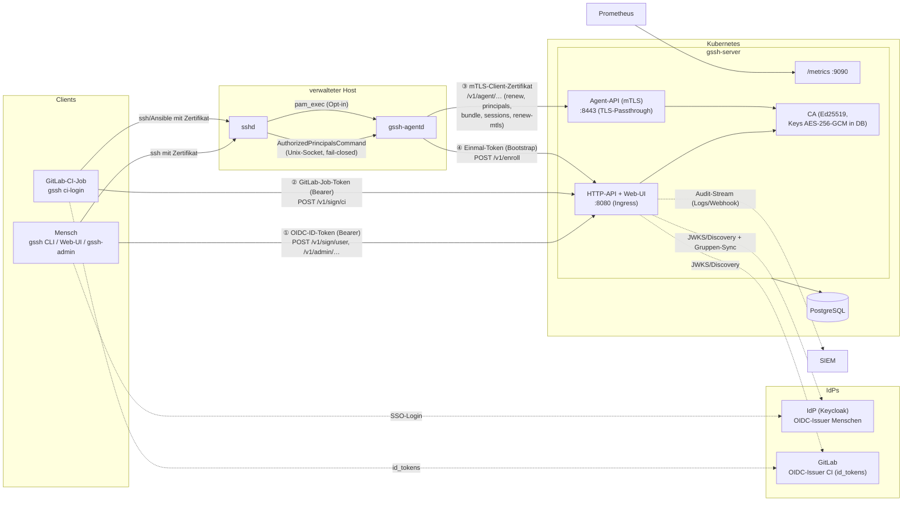

# Architektur

Überblick über Komponenten, Datenflüsse und Auth-Pfade. Die zugehörigen
Entscheidungen sind als ADRs festgehalten — Index: [adr/README.md](adr/README.md).
Betriebssicht: [betriebshandbuch.md](betriebshandbuch.md).

## Komponenten

| Komponente | Beschreibung |
|---|---|
| `gssh-server` | Ein Go-Binary: REST-API + CA, eingebettete Web-UI (Angular, `go:embed`, ADR-003), Agent-API (mTLS, eigener Port), Metrics-Endpoint (eigener Port). Stateless — skaliert horizontal |
| PostgreSQL | einzige Persistenz: Benutzer/Gruppen, Hosts/Tags, Grants, Zertifikats-Metadaten, verschlüsselte CA-Keys, append-only Audit (ADR-002) |
| `gssh` (CLI) | Benutzer-CLI: SSO-Login, Zertifikat nur im ssh-agent (ADR-016); `gssh ci-login` für GitLab-Jobs |
| `gssh-admin` (CLI) | Grant-/CI-Grant-Verwaltung über die Admin-API, deklaratives `apply` (GitOps) |
| Web-UI | read-mostly Ansichten + Grant-CRUD/Audit, Rollen aus IdP-Gruppen (ADR-020); nutzt dieselbe Admin-API |
| IdP (z. B. Keycloak) | OIDC-Issuer für Menschen (CLI: Code+PKCE/Device-Flow; UI: server-seitiger Code-Flow mit Client-Secret — BFF, Session-Cookie, kein Token im Browser); optional Gruppen-Sync über die Keycloak-Admin-API (ADR-015) |
| GitLab | zweiter, strikt getrennter OIDC-Issuer für CI-Job-Tokens (`id_tokens`, ADR-019) |
| Host: `gssh-agentd` + sshd | Host-Agent (Enrollment, Zertifikats-/Bundle-Pflege, Principals-Cache) und sshd mit `TrustedUserCAKeys` + `AuthorizedPrincipalsCommand` (ADR-017); optional Session-/sudo-Audit via pam_exec (ADR-021) |
| SIEM | optionaler Abnehmer der Audit-Events (JSON-Logs auf stdout und/oder Webhook) |

## Komponenten- und Auth-Pfad-Diagramm

Drei getrennte Auth-Pfade zur API (ADR-008) plus das einmalige
Enrollment-Token als Bootstrap:



## Datenflüsse

### SSO-Login (Mensch)

```mermaid
sequenceDiagram
    participant U as Benutzer (gssh)
    participant IDP as IdP
    participant API as gssh-server
    participant AG as ssh-agent
    participant H as Host (sshd + agentd)

    U->>IDP: OIDC Authorization Code + PKCE (Browser)<br/>bzw. Device-Flow
    IDP-->>U: ID-Token
    U->>U: ephemerales Ed25519-Schlüsselpaar
    U->>API: POST /v1/sign/user (Bearer ID-Token, Public Key)
    API->>API: Token verifizieren (iss/aud/exp/JWKS),<br/>Benutzer mappen (aktiv?), Grants prüfen
    API-->>U: Zertifikat (≤ 16 h, KeyID user:&lt;sub&gt;@&lt;idp&gt;,<br/>Principals: Username + E-Mail) + Audit-Event
    U->>AG: Key + Zertifikat laden (LifetimeSecs, nie auf Platte)
    U->>H: ssh deploy@host
    H->>H: AuthorizedPrincipalsCommand → agentd<br/>(Cache/API, fail-closed): passt ein Grant<br/>(Gruppe × Tag-Selektor × Ziel-User)?
    H-->>U: Session (optional pam_exec → Session-Audit)
```

### CI-Flow (GitLab)

Job-Token (`id_tokens`, `aud: guided-ssh`) → `gssh ci-login` →
`POST /v1/sign/ci`: Verifikation gegen den GitLab-JWKS, Matching der
CI-Grants (Projekt × Ref/`protected_only` × Environment × Tags), Laufzeit =
min(Grant, Policy 1 h, Token-`exp`), KeyID
`ci:<project>:<pipeline>:<job>`, Principals `ci:<project_path>` +
Namespace-Vorfahren. Details: [gitlab-ci.md](gitlab-ci.md).

### Enrollment und Host-Betrieb

Einmal-Token (`gssh-server enroll-token`, nur Hash in der DB) →
`POST /v1/enroll` mit Host-Public-Key + mTLS-CSR → Antwort: Host-Zertifikat,
`TrustedUserCAKeys`-Bundle, mTLS-Client-Zertifikat (CN = Host-UUID) + mTLS-CA.
Danach hält der Daemon alles aktuell: Host-Zertifikat und mTLS-Zertifikat
bei 2/3 der Laufzeit, CA-Bundle stündlich. Details:
[enrollment-guide.md](enrollment-guide.md).

### Principals-Abruf (ACL-Auswertung auf dem Host)

sshd fragt pro Login den `AuthorizedPrincipalsCommand`-Helper; der Daemon
antwortet aus dem Cache (< 10 s alt) oder über `GET /v1/agent/principals`
(mTLS, 5-s-Timeout). Der Server liefert die Identitäts-Principals aller
aktiven Mitglieder von Gruppen, deren Grant den lokalen User als
Ziel-Principal enthält und deren Tag-Selektor auf die Host-Tags passt —
plus `ci:<project>`-Principals aus passenden CI-Grants. Bei API-Ausfall
trägt der Cache bis `cache_ttl` (Default 5 m), danach fail-closed
(ADR-017/018/022).

### Session-Audit (Opt-in)

pam_exec-Hooks (sshd, sudo) → `gssh-agentd pam-session` (fail-open) →
Unix-Socket des Daemons (Token-geschützt) → lokaler Spool →
`POST /v1/agent/sessions` (mTLS, alle 15 s). Korrelation: sshd reicht
Serial (`%s`)/KeyID (`%i`) an den Principals-Helper, der Server löst den
Serial über `certificates` zum Benutzer auf (ADR-021).

### Gruppen-Sync

Periodischer Sync (Default 5 m) über die Keycloak-Admin-API
(`GSSH_KC_*`): Benutzer-/Gruppenbestand und Aktiv-Status. Entfernen aus
einer Gruppe wirkt auf Neuausstellung (keine Grants ⇒ 403) **und** auf die
Host-ACLs (Principals-Auskunft) — Offboarding ohne manuelle Schritte.
Zusätzlich kommen die Gruppen bei jeder Ausstellung frisch aus den
Token-Claims.

## Trennung der Auth-Pfade

| Pfad | Wer | Mechanismus | Endpunkte |
|---|---|---|---|
| ① Benutzer-OIDC | Menschen (CLI, Web-UI, gssh-admin) | ID-Token des IdP als Bearer; Audience = `GSSH_OIDC_CLIENT_ID`; Rollen/Grants dahinter | `/v1/sign/user`, `/v1/admin/…` |
| ② GitLab-OIDC | CI-Jobs | Job-Token (`id_tokens`) als Bearer; eigener Verifier, eigener Issuer, Audience = `GSSH_CI_AUDIENCE` (Default `guided-ssh`) | `/v1/sign/ci` |
| ③ mTLS | Host-Agenten | Client-Zertifikat der eigenen mTLS-Mini-PKI, Identität = CN (Host-UUID), pro Request gegen den Host-Datensatz aufgelöst | `/v1/agent/…` (eigener Listener) |
| ④ Enrollment-Token | neue Hosts (einmalig) | 256-bit-Einmal-Token, nur Hash gespeichert, transaktionaler Verbrauch | `/v1/enroll` |

Benutzer- und CI-Tokens sind nie austauschbar (getrennte Verifier; bei
gleichem Issuer erzwingt der Server unterschiedliche Audiences —
Startup-Check `checkAudienceSeparation`, siehe
[Security-Review](security-review-token-austausch.md)).

## Datenmodell (Kurzüberblick)

Schema in `internal/store/migrations/` (goose, ADR-012/013):

| Tabelle | Inhalt |
|---|---|
| `users`, `groups`, `user_groups` | aus dem IdP synchronisierter Bestand inkl. Aktiv-Status |
| `hosts`, `host_tags` | enrollte Hosts (`last_seen_at` = Heartbeat) und ihre Tags |
| `access_grants` | Gruppe × Tag-Selektor → Ziel-Principals, sudo, max. Laufzeit (ADR-018) |
| `ci_grants` | Projekt/Namespace × Ref-Bedingung × Tags → Principals, max. Laufzeit (ADR-019) |
| `service_accounts` | CI-Identitäten pro Projekt (`active` = Not-Aus) |
| `ca_keys` | CA-Keys (Zwecke user/host/mtls), Private Keys AES-256-GCM-verschlüsselt, Lebenszyklus active/retiring/retired (ADR-014) |
| `certificates` | jede Ausstellung: Serial, KeyID, Principals, Gültigkeit, Issuer-Kontext |
| `audit_events` | append-only (Trigger + DB-Grants), nach Monat partitionierbar ([audit-retention.md](audit-retention.md)) |
| `enrollment_tokens` | Token-Hashes, Tags, optionale Namensbindung, Ablauf/Verbrauch |
| `host_sessions` | Session-/sudo-Events der Hosts inkl. Serial-Korrelation (Phase 9) |

## Entscheidungen

Alle wesentlichen Architekturentscheidungen als ADRs:
[adr/README.md](adr/README.md) — insbesondere ADR-008 (Auth-Pfade),
ADR-014 (Software-Signer), ADR-016 (Agent-only-CLI), ADR-017 (Enrollment/mTLS),
ADR-018 (additive Grants), ADR-019 (GitLab-CI), ADR-021 (Session-Audit),
ADR-022 (Revocation).
